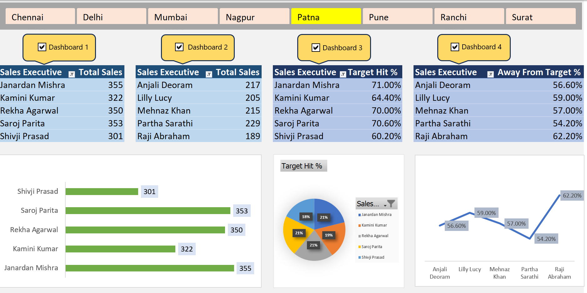

# Sales Performance Analytics Dashboard

An interactive Excel-based dashboard designed to track and visualize regional sales data, executive performance, and target achievement across multiple Indian cities.

## 📊 Dashboard Preview

## 🛠️ Technical Workflow & Features
### 1. Data Structuring (Raw Data)
* **Performance Metrics:** Calculated total sales over a 5-day period for each Sales Executive.
* **KPI Formulas:** Implemented dynamic calculations for:
    * **Target Hit %:** `(Total Sales / Target)`
    * **Gap Analysis:** `(Away From Target %)`
* **Data Organization:** Organized data by Employee Code, Region, and Daily Sales to ensure clean Pivot Table sourcing.

### 2. Interactive Dashboard
* **Dynamic Slicers:** Instant filtering by Region (Mumbai, Delhi, Nagpur, etc.).
* **Automated Summaries:** Used Pivot Tables to aggregate data from the raw sheet.
* **Visual Analytics:** * **Bar Charts:** Comparing individual sales totals.
    * **Pie Charts:** Visualizing the distribution of target achievement.
    * **Trend Lines:** Tracking the gap between current sales and goals.

## 📂 Project Structure
* `DASHBOARD`: The visual reporting layer for stakeholders.
* `RAW DATA`: The backend data containing executive-level performance metrics.

## 🚀 Skills Showcased
* Data Cleaning & Logic
* Advanced Excel Formulas
* Pivot Tables & Pivot Charts
* Dashboard UI/UX Design

